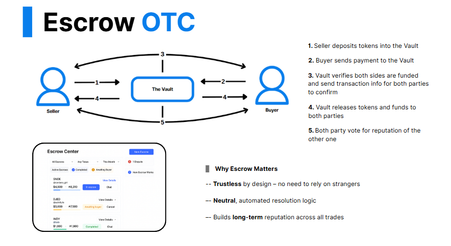
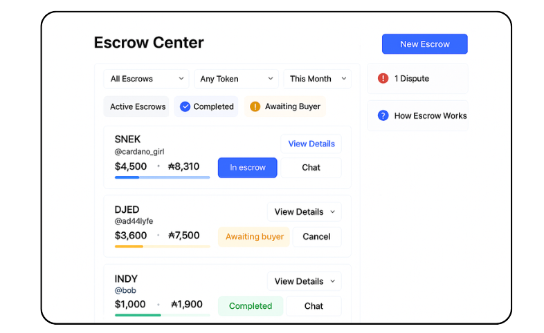

# Reputa Market – Full Project Description

## 1. Project Summary

**Reputa Market** is a decentralized OTC (over-the-counter) trading platform built on Cardano, designed to make peer-to-peer token exchange **safe, transparent, and reputation-driven**. Unlike traditional OTC transactions conducted over Telegram, Discord, or DMs, Reputa provides a structured environment where **every wallet is tied to a persistent profile**, **every trade is executed via smart contract escrow**, and **reputation is earned through real user feedback**.

The platform targets crypto traders, early token investors, and small project communities that frequently conduct OTC trades but lack infrastructure for safety and transparency.

---

## 2. Core Features

### 2.1 ReputaProfile

_ReputaProfile Overview_

Every wallet that connects to the platform is assigned a **ReputaProfile**. This profile is the foundation of the user’s trading identity and includes:

- Wallet address (auto-detected)
- Display name (optional)
- Avatar (customizable)
- Profile bio
- Trade statistics (total trades, success rate, total volume)
- Trade history (public view of past completed OTC deals)
- Counterparty reviews (1 to 5 star ratings + comments)
- Trust badges (Verified Seller, Escrow Compliant, Top Seller of the Month, etc.)
- Connected social accounts (Twitter/X, Discord, Telegram - verified via message signing)
- Date joined
- Current reputation status

Users **cannot modify their trade history or rating**, but may update their bio, avatar, and linked social accounts.

### 2.2 Escrow System

_Escrow State Machine - Happy Path_

_Escrow Dispute Flow_

All trades on Reputa are executed through a **smart contract-based escrow system** called **The Vault**.

Escrow process:

1. Seller deposits token into the Vault.
2. Buyer sends the agreed counter asset into the Vault (ADA for MVP; stablecoins and other assets per roadmap enablement).
3. The Vault validates both sides.
4. The deal is completed when both sides confirm.
5. Funds are automatically released in atomic settlement.
6. Both parties are prompted to rate each other post-trade.

Escrow features:

- Non-custodial; funds are only locked temporarily.
- Each escrow instance is traceable via on-chain tx hash.
- Timeout & auto-dispute logic in case of inactivity.
- Optional dispute escalation if either party fails to confirm.
- Includes minimum ADA at script UTxO, TTL on offers, and forced refund after SLA breach to prevent stuck funds.

Escrow logic is implemented using Cardano Plutus smart contracts with transparent logic and open-source code.

### 2.3 OTC Marketplace

_Marketplace with Seller Previews_

Reputa features a real-time, filterable **OTC marketplace** where users can list and browse OTC offers. The platform enables **Direct Deal** transactions through a streamlined **chat → link → escrow** flow, allowing users to initiate secure peer-to-peer trades directly from marketplace listings.

Marketplace listing components:

- Token (e.g., SNEK, DJED, INDY)
- Price per unit (in counter asset: ADA or supported stablecoin/token)
- Amount available
- Total deal value (auto-calculated)
- Seller profile preview (username, badge, rating)
- **Direct Deal**: chat → link → escrow with prefilled terms; link shows the seller’s ReputaProfile before funding.
- “Start Deal” button (initiates escrow)
- Listing age (auto-expiring if inactive too long)

Marketplace filters:

- Token
- Verified sellers only
- Price (ascending/descending)
- Most trusted / Most active

Marketplace updates in real-time, synced via backend polling or WebSocket channels.

### 2.4 Reputation Engine

Instead of scoring wallets based on algorithmic on-chain heuristics (which are often misleading), Reputa uses a **fully human-verified reputation model**, including:

- Per-deal review system (1 to 5 stars + optional comment). Only counterparties to a **completed escrow** can leave a review, one review per deal.
- Time-weighted credibility (recent trades matter more)
- Verified Seller system:
    - 10 successful trades
    - 0 unresolved disputes
    - Optional ADA collateral staking for verification badge
- Flagging/reporting system for repeated bad actors
- Append-only, versioned public profile history (stored in backend + IPFS mirror)
- Reputation weight is reduced for repeated trades between the same two wallets; collusion flags go to moderators.

This system ensures that **trust is earned**, not manipulated or bought.

### 2.5 Profile Migration

To support user flexibility, Reputa allows profile migration to another wallet with strict controls:

- Two-way message signing required from both old and new wallet
- 7-day cooldown window before migration is finalized
- Migration history is public and permanently visible on the profile
- Only one migration allowed per 90-day period
- Cannot migrate if under active dispute or with recent (last 7d) negative rating

This enables responsible users to rotate wallets while retaining their reputation.

### 2.6 Dashboard & User Experience

Reputa includes 3 main user-facing dashboard views:

- **My Profile:** Full view of ReputaProfile, edit options, review history, and social linking.
- **Escrow Center:** All current and past escrow trades, filters by status (Awaiting Buyer, In Progress, Completed, Disputed, Canceled).
- **Marketplace:** Global view of listings, discovery filters, and leaderboard of top sellers.

All dashboards are responsive, mobile-optimized, and built using a modern front-end stack (React/Next.js + Tailwind CSS).

---

## 3. Target Users

Reputa is built for:

- **Crypto traders** buying tokens pre-list or OTC
- **Project founders** distributing tokens without centralized exchange listing
- **Community buyers** looking for discounted entry into tokens
- **Power sellers** who want to build a public trading brand with verified reputation

---

## 4. Security Model

- All trades are executed via Plutus smart contracts that are open-source and rigorously tested (unit, property-based, and integration tests).
- No custodial wallet system - all funds are temporarily locked, not held.
- No user passwords; wallet login via CIP-30 dApp connector only.
- Dispute system handled on-chain and off-chain (via mod/admin roles). Moderator SLAs: 95% of flags reviewed ≤ 12h, 100% ≤ 24h.

---

## 5. Tech Stack

Designed for **security, speed-to-market, and auditability** on Cardano, with clear on/off-chain boundaries and public interfaces. All source code (frontend, backend, and smart contracts) is open-source under the MIT License; we provide detailed docs and verifiable on-chain artifacts. No third-party audits are planned; security is enforced via open development, automated testing (unit, integration, and property-based tests), and a public bug bounty.

## 5.1 Overall Architecture

**Please navigate to [Reputadocs.vercel.app](https://reputadocs.vercel.app/) to view the fully interactive flowchart.**

## 5.2 On-Chain (Cardano)

- **Era & Nets:** Cardano (Babbage); **preprod** for staging
- **Contracts:** **Aiken** (compiled to Plutus v2); reference scripts, inline datums, time locks
- **Escrow state machine:** Fund → Deliver → Settle (happy path); Dispute → arbiter outcome (split/return) after SLA window
- **Reputation/Identity:** **CIP-68** updatable NFT (“ReputaProfile”) as pointer to IPFS profile + optional batched review hashes
- **Standards:** CIP-30 (wallet), CIP-25 (metadata), CIP-31 (reference inputs), CIP-32 (inline datums), CIP-33 (reference scripts), CIP-68 (updatable NFTs)
- **Tx building:** **Lucid** (TypeScript); deterministic datum schema and fee/size checks

## 5.3 Frontend (Web App)

- **Framework:** **Next.js (App Router, TypeScript)**; SSR where helpful; SPA for signed flows
- **UI:** Tailwind + shadcn/ui; responsive, mobile-first; **English + Vietnamese** at launch
- **Wallets:** Lace, Eternl, Flint, Typhon (auto-detect, graceful fallback)
- **Hardening:** zod schemas, optimistic UI with server validation, client-side guards, gentle rate-limit hints
- **Accessibility:** semantic components, keyboard navigation, light/dark themes

## 5.4 API & Workers

- **Runtime:** **FastAPI (Python)**; **Redis queue** for async jobs (webhooks, timers, notifications)
- **Endpoints:** escrows, disputes, reviews, profiles, file-link requests, analytics events
- **Webhooks:** indexer callbacks (UTxO at scripts), IPFS pin confirmations
- **Tasks:** dispute SLA timers, reconciliation (chain ↔︎ DB), digest notifications
- **Auth:** wallet-based nonce sign-in; role claims for moderators/admins; rate limits and abuse caps per IP and per wallet to protect public endpoints.
- **Docs:** **Public OpenAPI** spec and Postman collection (source and examples included)

## 5.5 Data & Storage

- **DB:** **PostgreSQL (managed)** - users, listings, escrows, disputes, reviews, events
- **Security:** field-level encryption (pgcrypto), strict retention; no PII on-chain
- **Objects:** **IPFS** via pinning provider; store CIDs in DB
- **Backups:** daily snapshots (7-day rolling) + weekly long-term; restore drills scheduled
- **Privacy:** Users may unlink socials at any time. Removing socials does not remove trade history or reviews.

## 5.6 Node Access & Indexing

- **Primary:** **Blockfrost** for bootstrap and reliability
- **Optional self-hosted path:** **Ogmios + Kupo** for resilient reads/event streams; adapter layer enables hot swap without app changes
- **Ingestion:** Listener normalizes Kupo events → idempotent upserts into `escrow_events`

## 5.7 Identity & Wallet Integration

- **CIP-30** wallet bridge; nonce-challenge sign-in with session rotation
- **Profiles:** **CIP-68** NFT pointer to IPFS JSON; minimal on-chain footprint
- **Reviews:** full content off-chain; **hash anchoring** on-chain or in profile metadata for integrity

## 5.8 Analytics & Growth

- **Product analytics:** **PostHog** (can self-host later) - funnels, retention, feature flags
- **Attribution:** UTM capture; map campaigns to "first funded escrow", "first review", "dispute resolved"
- **Privacy:** anonymized IPs; no keystroke/session replay by default; opt-out toggle

## 5.9 Observability & Ops

- **Hosting:** Web on **Vercel**; API/workers on **Docker** (Fly.io or Hetzner)
- **CI/CD:** GitHub Actions - lint, typecheck, tests, Aiken compile/size gate, preview deploys
- **Monitoring:** **Sentry** (web+api), **Prometheus + Grafana** (API), Healthchecks.io uptime. SLOs: API p95 latency ≤ 300 ms, error rate ≤ 1% during normal load. Web p95 page load ≤ 2s on Marketplace and Escrow Center (matches 11.6).
- **Secrets:** OIDC to cloud secret manager; no secrets in repo

## **5.10 Security & Bounty**

Security is the foundation of Reputa Market. All escrow and dispute resolution logic is implemented in open-source Plutus smart contracts with controlled upgradeability. We rely on open development, community review, and comprehensive testing instead of third‑party audits.

**Transparency:**

- Publicly share **validator CBOR, script hashes, policy IDs**, and **datum/redeemer schema**.
- Provide a reproducible build manifest (compiler versions, dependency hashes) so anyone can reproduce binaries from source.

**Bug Bounty Program:**

- Continuous bug bounty post-launch, covering both the smart contracts (on-chain behavior) and the web application.
- Scope: black-box testing, exploit simulation, and transaction-level attacks.
- Rewards based on severity and impact.

**Terms of Service Boundaries:** No KYC, no fiat rails, and no securities. Listings violating ToS can be removed; repeat violators lose Verified status.

## 5.11 Testing & QA

- **Contracts:** Aiken unit tests + property-based invariants (no stuck funds; correct unlock paths). Key invariants:
  - No funds can be withdrawn without both sides funding.
  - Dispute path always unlocks exactly one of {split, return}.
- **Integration (preprod):** fund → deliver → settle; dispute → arbitrate → settle; regression suite per release
- **Frontend:** Playwright for wallet connect, escrow initiation, review submission
- **Load:** k6/Locust on API; chaos tests for burst disputes and delayed webhooks

## **5.12 Auditability & Reproducibility (Fully Open Source)**

Reputa Market is fully open source (frontend, backend, and smart contracts). Transparency is ensured by public repositories and verifiable artifacts.

**Auditability Measures:**

- Publish **on-chain artifacts**: validator CBOR, script hashes, policy IDs, and human-readable datum/redeemer schema.
- Maintain a **deterministic build manifest** so the community can rebuild identical binaries from source.
- Store artifact hashes and release notes in a permanent public location (IPFS).

**Reproducibility Process:**

- Fully public source repositories; anyone can reproduce builds and verify logic.
- Community receives with each release:
    - Changelog and artifact hashes.
    - Confirmation of deterministic build match.
    - Test coverage and property-based invariant summaries.

## 5.13 Swap-Out Options (Cost Control / Sovereignty)

- Blockfrost → self-host **Ogmios + Kupo**
- Managed Postgres → self-managed Postgres (Hetzner) with pgBackRest
- PostHog Cloud → self-hosted PostHog or Umami
- IPFS pinning provider → alternative provider or self-pinned gateway

---

## 6. Monetization Strategy

Initial version of Reputa is fee-less to incentivize usage. Later monetization models include:

- Escrow fee (0.5% or flat fee in ADA)
- Pro tools subscription (analytics, advanced listing boosts). Verification remains earned/collateral-based and cannot be purchased.
- Marketplace listing boost/promotion fees
- Optional token integration

---

## 7. Roadmap (Milestones)

**Phase 1 (1 month): Research & System Design**

- Define the full technical architecture, covering on-chain/off-chain boundaries.
- Draft escrow smart contract structure (escrow logic, dispute resolution, identity mapping).
- Design initial UI/UX wireframes and user flows.
- Select tech stack (smart contract framework, backend, frontend, infra).
    
    **Deliverables:**
    
- System architecture diagrams.
- Smart contract logic draft (pseudocode/spec).
- UI/UX wireframes.
- Development & deployment strategy document.

**Phase 2 (2 months): MVP Development (Testnet) – Delivery in Month 3**

- Build marketplace listing system with live filtering and seller previews.
- Implement ReputaProfile with public trade history, ratings, and wallet linking.
- Deploy escrow smart contracts on Cardano **testnet** with basic dispute logic.
- Integrate trade review + rating system.
- Frontend integration with Cardano wallet (CIP-30).
    
    **Deliverables:**
    
- Fully functional MVP on testnet.
- 80% feature coverage (core marketplace, escrow, reputation engine).
- **Acceptance Criteria:** Publish CBOR + checksums, ≥80% MVP coverage achieved, smart contracts deployed to testnet with successful escrow flow testing.

**Phase 3 (1 month): Testing, Community Launch & Hardening**

- Internal QA + public demo with real testnet trades.
- Onboard first wave of verified sellers & moderators.
- Gather bug reports, UI feedback, and identify edge cases.
- Feature-freeze smart contract logic for stabilization and community review.
    
    **Deliverables:**
    
- Public testnet version.
- Verified Seller module operational.
- Initial community usage metrics.
- Release-candidate smart contract package (compiled validators, CBOR, spec).
- **Acceptance Criteria:** ≥25 bugs closed; ≥10 verified sellers; P95 escrow ≤ 2 min.

**Phase 4 (1 month): Mainnet Launch & Marketing**

- Finalize stabilization fixes and deploy to **mainnet**.
- Enable token integration (ADA, stablecoins, select Cardano-native tokens).
- Launch DAO-based moderation framework.
- Execute community marketing campaigns & referral programs.
    
    **Deliverables:**
    
- Smart contracts deployed to mainnet.
- Live platform with verified sellers and dispute resolution.
- Public release notes + reproducible artifact hashes.
- Marketing performance report (first 30 days).
- **Acceptance Criteria:** D30 600–1000 wallets, 100–200 escrows, volume 15k–50k ADA, spend ≤ ₳12,500, CAC ≤ ₳31.25. DAO moderation meets SLA: 95% of flags reviewed ≤ 12h and 100% ≤ 24h (D30).

**Phase 5 (1 month): Final Report & Documentation**

- Write final technical documentation and API spec.
- Produce tutorial content (walkthroughs, video guides).
- Publish post-launch performance metrics.
- Provide **public GitHub repositories for frontend, backend, and smart contracts**.
    
    **Deliverables:**
    
- Full project report with metrics.
- User & developer documentation.
- Public GitHub repositories for all components.
- Project summary video.
- **Acceptance Criteria:** 1000-1400 cumulative connected wallets, 200-500 cumulative escrows, 50k-100k ADA volume, DAO moderator SLA ≤12h/24h, all repositories public with MIT license.

---

## 8. Competitive Advantage

Reputa is not just a P2P trading platform. It introduces **identity and accountability into Web3 trading**, a space dominated by burner wallets and trustless messaging.

Compared to competitors:

| Platform | Escrow | Public Profile | Reviews | Identity Linking | Reputation Engine |
| --- | --- | --- | --- | --- | --- |
| Telegram OTC | ❌ | ❌ | ❌ | ❌ | ❌ |
| Whales Market | ✅ | ❌ | ❌ | ❌ | ❌ |
| Reputa Market | ✅ | ✅ | ✅ | ✅ | ✅ |

---

## 9. Expenses & Salary Breakdown

The Reputa Market MVP is scoped to be delivered under a **100,000 ADA total budget** (planned at $0.80/ADA ≈ $80,000). The product will be built by a skilled, focused team at professional rates, with efficient hours and milestones. The rest of the budget is allocated to **infrastructure & tooling**, **marketing**, and **community incentives**, ensuring not only a successful build, but adoption.

### 9.1 Team Assumptions

| Role | Rate/hour (ADA) | Estimated Total Hours | Cost Estimate (ADA) |
| --- | --- | --- | --- |
| Fullstack Developer | 83.5 | 280 hrs | 23,380 |
| Smart Contract Engineer | 83.5 | 200 hrs | 16,700 |
| UI/UX Designer | 66.8 | 60 hrs | 4,008 |
| QA / Project Manager | 66.8 | 90 hrs | 6,012 |
| **Subtotal Team Cost** | - | - | **50,100** |

### 9.2 Infrastructure & Tooling

| Category | Description | Cost (ADA) |
| --- | --- | --- |
| Infrastructure & Tools | Hosting, DB, IPFS, backend services | 5,800 |
| Open-source Security Tooling & CI Credits | SAST, dependency scanning, CI minutes/credits | 2,500 |
| **Subtotal** | - | **8,300** |

### 9.3 Marketing & Community Growth

| Category | Description | Budget (ADA) |
| --- | --- | --- |
| Airdrop & Referral Campaigns | Onboarding incentives to grow verified user base | 6,700 |
| Social Marketing & Ads | Twitter/X ads, influencer threads, visuals | 5,000 |
| Content & Community Manager | Part-time (1–2 months) for growth campaigns | 2,500 |
| KOL/Spaces Collaborations | Cross-promotions with trusted OTC figures | 1,700 |
| Design Assets & Video | Motion design, social kits | 1,600 |
| **PR & Launch Push** | Press kit, distribution to crypto media, launch promos | 3,750 |
| **Product Hunt/Launch Week** | Paid placements, featured spots, promo bundles | 3,125 |
| **Attribution & Analytics Tools** | Link tracking, funnel analytics, dashboards | 1,250 |
| **Ambassador Microgrants** | Regional moderators, creator UGC micro-budgets | 1,875 |
| **Subtotal** | - | **27,500** |

### 9.4 Community Incentives & Events

| Category | Description | Budget (ADA) |
| --- | --- | --- |
| Bug Bounty Program | Pay-per-bug model for security vulnerability reports | 3,300 |
| OTC Trader Contests | Volume-based leaderboard or review-based rewards | 1,700 |
| Verified Seller Grant | Cover escrow gas/ADA for new sellers (x100 users) | 850 |
| Discord/Telegram Events | Giveaways and token-based engagement prizes | 1,700 |
| **Subtotal** | - | **7,550** |

### 9.5 Contingency & Reserve

| Category | Description | Budget (ADA) |
| --- | --- | --- |
| Unforeseen Costs | Buffer for ops, UX iteration, bugs | 6,550 |

### 9.6 Total Budget Overview

| Category | Amount (ADA) |
| --- | --- |
| Team Compensation | 50,100 |
| Infrastructure & Tooling | 8,300 |
| Marketing & Community Growth | 27,500 |
| Community Incentives & Events | 7,550 |
| Contingency Reserve | 6,550 |
| **Total Budget Required** | **100,000** |

### 9.7 Budget Stability & Risk Management

**Pricing Stability Considerations:** Cloud infrastructure costs, API usage, and advertising inventory can fluctuate based on market conditions and usage patterns. Additionally, ADA ↔ USD exchange rates may vary during the project timeline. We will actively manage vendor relationships and scale operations to keep actual expenditures close to the planned ADA budget. Any significant variances will be reported monthly to the community, and we maintain the flexibility to adjust scope or reallocate funds between categories as needed. This approach complements the "Swap-Out Options" already detailed in section 5.13 (Blockfrost→Ogmios+Kupo, PostHog→self-host, etc.) to ensure cost control and sovereignty.

---

## 10. Market & User Growth Strategy

Reputa Market grows through **community-first adoption**. It empowers real users - OTC traders, project founders, and community managers - to **transact with trust** and build reputations that matter. Instead of targeting broad retail markets, Reputa focuses on where Cardano’s social capital is already concentrated: **Telegram groups, Discord servers, and grassroots token communities.**

This approach turns each early user into a **co-builder of trust**, not just a product user.

### 10.1 Target Communities

- **Cardano-native OTC traders** active in private channels and early token deals
- **Emerging project founders** looking to list tokens and bootstrap trust
- **Community mods and admins** who facilitate trades but want safer tools
- **Power users and repeat sellers** who want to grow a visible, verifiable identity
- **DAO and NFT community members** exchanging assets informally

### 10.2 Community Growth Channels

- **Partner with grassroots token projects**
    
    Help projects launch private token sales or internal OTC boards using Reputa - making it part of their community stack.
    
- **Community-led onboarding campaigns**
    
    Equip mods and power users with custom invite links and referral tools. Reward early adopters who bring in verified users.
    
- **“Trusted Seller” spotlight events**
    
    Publicly highlight active, verified users to showcase reputation mechanics. Create a sense of status and trust through transparent metrics.
    
- **Bounties and user-created content**
    
    Launch small-scale content contests: trade guides, safety explainers, demo videos. Let the community teach the community.
    
- **Embedded Discord/TG tools**
    
    Provide lightweight bots or widgets that let communities display profile links, active trades, or escrow statuses directly in chats.
    

### 10.3 Retention through Identity & Reputation

- Every user builds a **persistent, recognizable ReputaProfile** - giving them a reason to return and grow their identity.
- Verified sellers earn higher visibility and access to exclusive trading tools, encouraging performance-based participation.
- Trading history, reviews, and dispute records create a **self-reinforcing trust loop**: good actors get rewarded with more activity.

**In short:** Reputa’s growth is not driven by ads or hype, but by **community trust compounding over time**. Each successful trade builds more than a transaction - it builds a public signal that makes Cardano stronger.

---

## 11. KPIs & Measurement Plan

### 11.1 Definitions & instrumentation

- **Connected wallet:** unique wallet that signs in via CIP-30.
- **Activated trader:** first **funded escrow** completed (primary activation event).
- **CAC** = marketing spend in the period ÷ activated traders in the same period.
- **Verified Seller:** profile with **10 successful trades** and **0 unresolved disputes**.
- **Completed escrow:** escrow that settles on-chain (happy path).
- **Dispute rate:** % of escrows entering dispute.
- **Repeat-trade ratio:** % of activated traders with ≥2 completed escrows in the period.

**Instrumentation:** PostHog funnels + UTM attribution; map campaigns to "first funded escrow", "first review", "dispute resolved". Weekly dashboards + a **30-day launch report**.

**Budget context:** **27,500 ADA** for Marketing & Community Growth + **7,550 ADA** for Community Incentives in MVP scope. Targets below are sized to this envelope.  

### 11.2 Pre-Mainnet (P3 – Pre-Production Testnet, "community launch & hardening")

- **Connected wallets:** 300–400
- **Activated testers (testnet funded escrows):** 120–180
- **Completed testnet escrows:** 250–400
- **P95 escrow flow time (init → settle):** ≤2 minutes
- **Dispute rate:** ≤4%; **median resolution time:** ≤48h
- **Bugs found via QA/bug-bounty:** 25–40, all high/critical closed before P4 (per QA plan).

### 11.3 Mainnet KPIs – first 30 days (P4 D30)

- **Connected wallets:** 600–1000
- **Completed escrows:** 100–200
- **OTC volume:** 15k–50k ADA (report ADA-denominated to avoid FX noise).
- **Verified Sellers:** 10+ (measured by the 10-trades rule).
- **Dispute rate:** ≤3.0%; **median resolution time:** ≤24h
- **Spend in D30:** ≤₳12,500 from marketing lines (PR + Product Hunt/Launch Week + X ads). **CAC (per activated trader):** ≤₳31.25.
- **Publish "Marketing performance report (first 30 days)"** with funnel + CAC by channel.

### 11.4 Mainnet KPIs – first 90 days (P4 D90)

- **Connected wallets (cumulative):** 1000–1400
- **Completed escrows (cumulative):** 200–500
- **OTC volume (cumulative):** 50k–100k ADA
- **Verified Sellers:** 15+
- **Dispute rate:** ≤2.5%; **median resolution time:** ≤24h; **unresolved >7d:** 0
- **Referral-sourced activations:** ≥30% (airdrops/referrals/ambassadors).

### 11.5 Trust, Safety & Moderation

- **Moderator SLA:** 95% of flags reviewed ≤12h; 100% ≤24h.
- **False-positive rate on flags:** ≤5% (monthly audit).
- **Appeal turnaround:** ≤48h.
- **Identity integrity:** 100% of Verified Sellers have unchanged status during disputes (policy-enforced).

### 11.6 Product Quality & Reliability

- **Uptime:** ≥95% (web + API).
- **P95 page interactive (Marketplace, Escrow Center):** ≤2s.
- **P99 contract failure rate (non-user error):** ≤0.5%.
- **Test coverage:** Aiken unit/property tests ≥90%; backend integration ≥80%; E2E wallet flows stable (Playwright CI).
- **Security:** zero "stuck funds" incidents; bounty program active with monthly report.

### 11.7 Growth Efficiency & Budget Guardrails

- **Marketing spend vs. plan:** ≤100% of allocated **27,500 ADA** across launch quarter.
- **Cost per activated trader (blended):** target **₳18.75–₳25** over Q1 post-launch.
- **Attribution completeness:** ≥85% of activations have tagged source/medium.

### 11.8 Reporting cadence

- **Weekly:** KPI snapshot to community (wallets, activations, escrows, disputes, CAC).
- **Monthly:** deep-dive with channel ROI, retention, cohort repeat rates, and Verified Seller growth.
- **Launch D30 report:** public write-up with metrics, lessons, and next-month targets.

---

## 12. Ecosystem Benefit

**Reputa Market** is not just a product - it’s an infrastructure upgrade for how people **trust and trade** in the Cardano ecosystem. By enabling safer, identity-aware OTC transactions with built-in reputation, it strengthens both **user experience** and **ecosystem integrity** at multiple levels.

### 12.1 Strengthening the Cardano Ecosystem

- **Reduces scam-related friction in Cardano communities**
    
    Many Cardano-based token holders currently rely on unmoderated OTC via Telegram or Discord. Reputa creates a safer, escrow-backed environment to eliminate scam risk, improving Cardano’s public reputation for security.
    
- **Creates foundational infrastructure for token economy**
    
    As new tokens launch on Cardano, early private buyers and community traders need a place to exchange tokens that’s more reliable than ad-hoc messaging. Reputa acts as an **onboarding layer** for grassroots liquidity.
    
- **Boosts utility of on-chain identity and metadata standards**
    
    By tying wallets to public profiles, reviews, and social metadata (X, Telegram, Discord), Reputa showcases practical usage of Cardano’s decentralized identity stack - without breaking privacy.
    
- **Demonstrates real-world use case for Plutus smart contracts**
    
    The escrow and dispute systems use native Cardano scripting (Plutus), creating a high-visibility example of non-financial, trust-based smart contract logic in production.
    

### 12.2 Fueling Cardano’s Growth

- **Accelerates token adoption and circulation**
    
    By enabling verified sellers to safely list and complete OTC trades, projects can distribute tokens before or without exchange listings, increasing **velocity and visibility**.
    
- **Encourages retention of Web3 users on Cardano**
    
    Many users flee to other chains due to lack of tools or trust in peer transactions. Reputa gives them a reason to stay and build long-term trading identities on Cardano.
    
- **Opens up a gateway for future integrations**
    
    Reputa Profiles can become the base layer for Cardano-native identity extensions: NFT verification, DeFi score tracking, DAO membership credentials, etc.
    

### 12.3 User Benefits

- **Trust & Reputation Without Centralization**
    
    Users no longer have to “trust strangers” - reputation is earned, recorded, and visible. All trades are escrowed automatically, reducing emotional risk.
    
- **One-click OTC trading with built-in safety**
    
    No more back-and-forth wallet screenshots, proof-of-payment confusion, or gasless scams. The Reputa Vault handles it all securely.
    
- **Profile portability and growth**
    
    As users trade, they grow a **portable, on-chain identity**. Verified sellers can build public credibility and become power traders within the Cardano ecosystem.
    
- **Community empowerment**
    
    Small projects can bootstrap liquidity, reward early supporters, and track participation - all through a public and secure OTC layer.
    

---

**In summary**, Reputa makes Cardano safer, stickier, and smarter - by embedding **trust into every transaction**. It delivers technical infrastructure, user safety, and real economic activity, aligned with Cardano’s long-term values.
